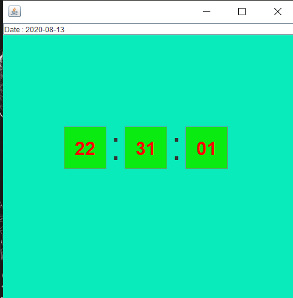

# Utility

In this repository I create some utility base UI project.

## DayFinder

### File
```
FinderUI.java - This file contains the UI design for this project

Utility.java  - This file contains the algorithm for to find the day for the given data.
```

Using the below comment you will run this code.

```
For compile : javac FinderUI.java

For run     : java  FinderUI
```


## ShortCut

### To Open some application give the following name
```
- Calculator --> calc
- Notepad    --> Notepad
- Paint      --> mspaint
```

Using the below comment you will run this code.

```
For compile : javac Shortcut.java

For run     : java  Shortcut
```


## Clock

In this program I just created a simple digital clock.

Using the below comment you will run this code.

```
For compile : javac EClock.java

For run     : java  EClock
```





## Screenshot

Using this program we will take screenshot.

Using the below comment you will run this code.

```
For compile : javac ScreenShot.java

For run     : java  ScreenShot
```

After run the program, the small button appears on the screen. Using this key we will take screenshot.


